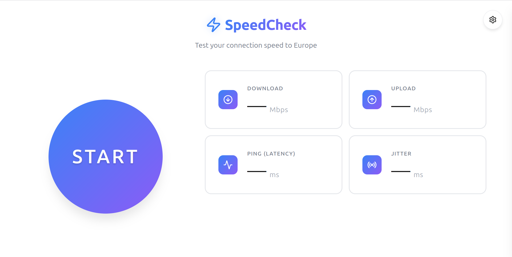
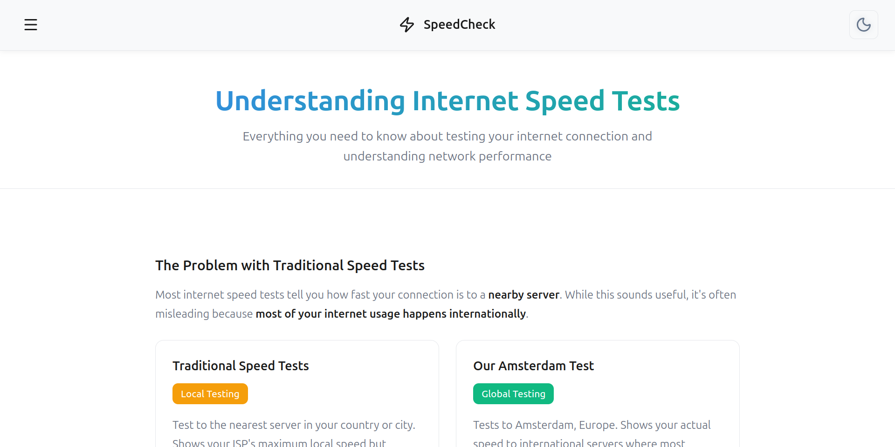

# SpeedCheck 

> Test your real-world international internet speed

[](https://speed-test.up.railway.app/)
[](#license)
[](#)

**[🚀 Try it live](https://speed-test.up.railway.app/)** • **[📚 Learn More](https://speed-test.up.railway.app/learn)**

### 📸 Application Screenshots

<div align="center">

**Main Speed Test Interface**



**Educational Content Page**



</div>

---

## 🎯 What Makes SpeedCheck Different?

Most internet speed tests use **nearby servers** to show you optimal speeds - but that's not how you actually use the internet. SpeedCheck measures your **real-world international connectivity** by testing your connection to a server in **Amsterdam, Netherlands**.

### SpeedCheck vs Other Speed Tests

| Feature | SpeedCheck | Traditional Speed Tests |
|---------|------------|------------------------|
| **Server Location** | Amsterdam, Netherlands (Fixed) | Automatically selects nearest server |
| **What It Measures** | Real international performance | Idealized local network speed |
| **Use Case** | Streaming European content, international browsing, video calls abroad | Local network capacity testing |
| **Distance Impact** | Reflects actual routing and latency | Minimizes distance to show best case |
| **Real-World Accuracy** | Shows speeds you'll actually experience for global content | Shows theoretical maximum speeds |

### When to Use SpeedCheck

✅ **Use SpeedCheck when:**
- You want to know your actual speed to European servers
- You're troubleshooting international streaming (Netflix, BBC iPlayer, sports streams)
- You need to understand your latency for international video conferencing
- You're curious about undersea cable and intercontinental routing performance

❌ **Use traditional speed tests when:**
- You want to test your ISP's maximum local bandwidth
- You're troubleshooting issues with your local network equipment
- You need to verify you're getting the speeds promised by your ISP contract

---

## 🌍 Why Europe?

Our server is hosted in **Amsterdam, Netherlands** - a major internet hub with excellent global connectivity. Testing to a fixed European location provides:

- **Consistent baseline** for comparing results over time
- **Real-world international routing** through undersea cables and continental networks
- **Meaningful metrics** for accessing global content hosted in Europe or routed through European CDNs
- **Distance-based performance** that reflects actual usage patterns for international content

**Physical Reality:** Internet signals don't travel instantly. Light moves at 300,000 km/s, but internet data travels slower through fiber optic cables. Distance creates unavoidable latency - SpeedCheck shows you this reality.

---

## 📊 Understanding Your Results

### Download Speed
How fast you can receive data from European servers. Important for streaming video, downloading files, and loading web pages hosted internationally.

### Upload Speed
How fast you can send data to European servers. Critical for video conferencing, uploading files to cloud storage, and online gaming.

### Ping (Latency)
The round-trip time for a signal to reach Amsterdam and return. **Lower is better.** Physics limits this based on distance - expect 150-300ms from Africa, 100-200ms from Middle East, 10-50ms from Europe.

### Jitter
How consistent your connection is. **Lower is better.** High jitter causes stuttering in video calls and unstable streaming. Good connections have jitter under 20ms.

---

## ✨ Features

### User Experience
- ⚡ **Real-time Updates** - Live gauge and metrics during test
- 🎯 **Progress Indicators** - Animated border progress on each measurement phase
- 📱 **Mobile Responsive** - Seamless experience on all devices
- 🌓 **Dark/Light Theme** - System preference detection with manual toggle
- 🎨 **Pure CSS Gauge** - 270° arc progress indicator (no chart libraries)
- 📊 **Comprehensive Metrics** - Download, Upload, Latency, Jitter
- ⚙️ **Configurable Tests** - Adjust parallel connections and test duration
- 🔒 **Secure & Private** - No data logging, no tracking, no analytics
- 📲 **PWA Support** - Add to Home Screen capability with proper icons

### Educational Content
- 📚 **Comprehensive Guide** - [/learn](https://speed-test.up.railway.app/learn) page explaining concepts
- 🌍 **Real-world Examples** - Kenya, Brazil cases showing local vs international speeds
- 📖 **Glossary** - All networking terms explained
- 💡 **Why Amsterdam** - Understanding server location impact
- 🔢 **Mbps vs MB/s** - Unit conversion guide

### Technical Features
- 🚀 **Zero Dependencies** - Pure vanilla JavaScript, no frameworks
- 📦 **Minimal Bundle** - Fast loading, efficient code
- ♿ **Accessible** - WCAG compliant, keyboard navigation
- 🔍 **SEO Optimized** - Open Graph, JSON-LD, sitemap.xml
- 🎭 **Custom 404** - Helpful error page with navigation
- 🎨 **Multi-format Icons** - SVG + PNG fallbacks for maximum compatibility
- ⚡ **Optimized Routing** - Express static middleware for clean URLs

---

## 🔧 Technical Architecture

### Project Structure

```
internet_speed_test/
├── frontend/                 # Frontend web application
│   ├── index.html           # Main speed test interface
│   ├── learn.html           # Educational content page
│   ├── 404.html             # Custom error page
│   ├── main.js              # Speed test logic & UI management
│   ├── main.css             # Complete styling with theme support
│   ├── server.js            # Express static server with 404 handling
│   ├── package.json         # Frontend dependencies
│   ├── site.webmanifest     # PWA manifest for Add to Home Screen
│   ├── favicon.svg          # Scalable site icon (Lucide zap)
│   ├── favicon-192x192.png  # PWA icon (Android/Chrome)
│   ├── favicon-512x512.png  # PWA icon (high-res devices)
│   ├── sitemap.xml          # SEO sitemap
│   └── robots.txt           # Search engine directives
└── backend/                 # API server
    ├── server.js            # Express server with API endpoints
    └── package.json         # Backend dependencies & scripts
```

### Frontend Stack
- **Pure HTML/CSS/JavaScript** - Zero frameworks, fast loading, minimal bundle
- **CSS Conic Gradient Gauge** - 270° arc progress indicator with real-time updates
- **Progress Border Animation** - Real-time requestAnimationFrame-driven border progress
- **Multi-threaded Testing** - Parallel connections for accurate speed measurement
- **Responsive Design** - Mobile-first approach with breakpoints
- **Lucide Icons** - Clean, modern SVG iconography
- **Theme Support** - Dark/light mode with system preference detection
- **PWA Manifest** - Add to Home Screen with multiple icon formats (SVG + PNG)
- **SEO Optimized** - Open Graph, JSON-LD structured data, sitemap

### Backend Stack
- **Node.js + Express 5.1.0** - Lightweight REST API
- **Railway Hosting** - Deployed in Amsterdam, Netherlands (fixed location)
- **Security Middleware** - Helmet.js, CORS, compression
- **Efficient Binary Transfer** - Uncompressed data streams for accurate testing
- **Rate Limiting** - Protection against abuse
- **Health Monitoring** - `/health` endpoint for uptime checks

### API Endpoints

#### Speed Testing
- **`GET /api/ping`** - Single ping round-trip time measurement
  - Returns: `{ latency: number }` in milliseconds
  
- **`POST /api/ping-batch`** - Multiple pings for jitter calculation
  - Body: `{ count: number }` (default: 10)
  - Returns: `{ latencies: number[], jitter: number }`
  
- **`GET /api/download`** - Download speed test
  - Query: `?size=<MB>` (default: 10MB, max: 50MB)
  - Returns: Binary data stream (uncompressed for accuracy)
  - CORS: Enabled for browser testing
  
- **`POST /api/upload`** - Upload speed test
  - Body: Binary data stream
  - Returns: `{ receivedBytes: number, duration: number }`
  - Note: Uses streaming for memory efficiency

#### Metadata & Health
- **`GET /api/info`** - Server information
  - Returns: `{ location, provider, region, timestamp }`
  
- **`GET /health`** - Health check endpoint
  - Returns: `{ status: 'healthy', uptime: number }`

---

## 🚀 Deployment Architecture

This application uses a **split deployment** on Railway with two separate services:

### Service 1: Frontend (Express Static Server)
- **URL:** https://speed-test.up.railway.app/
- **Type:** Express.js static file server with 404 handling
- **Port:** 8080
- **Files:** HTML, CSS, JS, assets
- **Purpose:** User interface and client-side logic
- **Features:** Custom 404 error page, clean URL routing

### Service 2: Backend (API)
- **URL:** https://speed-test-backend.up.railway.app/
- **Type:** Node.js Express server
- **Port:** 3000
- **Location:** Amsterdam, Netherlands (fixed)
- **Purpose:** Speed test API endpoints

Both services are deployed from the same repository with automatic deployments on push to `main` branch.

---

### Railway Configuration

Create two services in your Railway project:

**Frontend Service:**
```bash
# Build Command:
cd frontend && npm install

# Start Command:
cd frontend && npm start

# Root Directory: /
# Watch Paths: frontend/**
```

**Backend Service:**
```bash
# Build Command:
cd backend && npm install

# Start Command:
cd backend && npm start

# Root Directory: /
# Watch Paths: backend/**
```

### Environment Variables (Backend)

| Variable | Description | Default |
|----------|-------------|---------|
| `PORT` | Server port | 3000 |
| `NODE_ENV` | Environment mode | development |
| `SERVER_LOCATION` | Server region label | Amsterdam, Netherlands |
| `CORS_ORIGIN` | Allowed CORS origins | * |
| `MAX_DOWNLOAD_SIZE_MB` | Maximum download test size | 50 |
| `MAX_UPLOAD_SIZE_MB` | Maximum upload test size | 50 |
| `ENABLE_RATE_LIMIT` | Enable rate limiting | true |

---

## 💻 Local Development

### Prerequisites
- Node.js 18+ and npm
- Git

### Setup

```bash
# Clone the repository
git clone https://github.com/ny-collins/internet_speed_test.git
cd internet_speed_test

# Install backend dependencies
cd backend
npm install

# Install frontend dependencies
cd ../frontend
npm install
```

### Running Locally

**Backend (Terminal 1):**
```bash
cd backend
npm run dev  # Starts on http://localhost:3000
```

**Frontend (Terminal 2):**
```bash
cd frontend
npm start  # Starts on http://localhost:8080
# Access at http://localhost:8080
```

### ⚠️ Important Note on Local Testing

**Local speed tests will show unrealistic results!** If you test against `localhost`, you'll see speeds of 1000+ Mbps because:

- ❌ **No network distance** - Data doesn't leave your computer
- ❌ **No routing overhead** - Bypasses all internet infrastructure  
- ❌ **No ISP involvement** - No real internet connection
- ❌ **Perfect conditions** - Not representative of actual performance

**For accurate measurements, always test against the [live deployment](https://speed-test.up.railway.app/).** The value of this tool is measuring real international connectivity.

### Development Workflow

1. **Make changes** to frontend or backend code
2. **Test locally** for UI/UX and functionality
3. **Test speed measurements** against live deployment
4. **Commit and push** to trigger automatic Railway deployment

---

## 📖 What This Project Teaches

This project demonstrates real-world internet concepts:

1. **Internet Geography** - Distance matters; signals can't travel faster than physics allows
2. **Network Routing** - Connection quality depends on multiple hops, undersea cables, and ISP routing
3. **CDN Reality** - Content hosted far away will always be slower than local content
4. **Real-world Performance** - Benchmarks with nearby servers don't reflect actual usage
5. **Latency vs Bandwidth** - High bandwidth doesn't help if latency is high (critical for gaming/calls)
6. **Network Congestion** - Time of day and routing affects international speeds
7. **Jitter & Stability** - Consistent connections matter more than peak speeds for real-time apps

---

## 🎓 Use Cases

### For Users
- ✅ Test if your connection can handle 4K streaming from European services
- ✅ Troubleshoot international video conference quality
- ✅ Understand why European websites feel slower than local ones
- ✅ Compare your actual international speeds with ISP promises

### For Developers
- 💻 Learn multi-threaded speed testing implementation
- 💻 Study responsive web design patterns
- 💻 Understand internet routing and latency concepts
- 💻 See pure CSS gauge implementation without dependencies

### For Network Engineers
- 🔧 Baseline international routing performance
- 🔧 Debug ISP peering and routing issues
- 🔧 Measure undersea cable capacity impact
- 🔧 Analyze time-of-day congestion patterns

---

## 🤝 Contributing

Contributions are welcome! Areas for improvement:

- 🎨 **UI/UX improvements** - Better visualizations, animations
- 📚 **Educational content** - More examples, diagrams, explanations
- ⚡ **Performance optimizations** - Faster loading, better caching
- ♿ **Accessibility** - Screen reader support, keyboard navigation
- 🌍 **Internationalization** - Multi-language support
- 📝 **Documentation** - Better guides, API docs, tutorials
- 🧪 **Testing** - Unit tests, integration tests

### Contribution Guidelines

1. **Fork** the repository
2. **Create** a feature branch (`git checkout -b feature/amazing-feature`)
3. **Test** your changes locally
4. **Verify** speed measurements against live deployment (not localhost)
5. **Commit** with clear messages (`git commit -m 'Add amazing feature'`)
6. **Push** to your branch (`git push origin feature/amazing-feature`)
7. **Open** a Pull Request

### Code Style
- Use consistent formatting (2 spaces, semicolons)
- Keep comments minimal (section markers only)
- Self-documenting code preferred
- Test on multiple browsers/devices

---

## 📋 Version History

### v1.04 (Current)
- 🎨 Added PWA support with multi-format icons (SVG + PNG fallbacks)
- ⚡ Optimized Express routing (removed redundant explicit routes)
- 🔍 Fixed sitemap.xml (removed 404.html for better SEO)
- 🧹 Applied DRY principle to theme icon updates
- 📸 Added learn page screenshot to documentation
- 🗂️ Removed redundant files for better organization

### v1.03
- ✨ Added comprehensive `/learn` educational page
- 🎯 Real-time progress border animations during measurements
- 🎨 Refined favicon matching header icon
- 🧹 Complete code cleanup (removed verbose comments)
- 📄 Custom 404 error page
- 📚 Enhanced README with technical documentation
- 🔍 Improved SEO with updated sitemap

### v1.02
- 🌓 Dark/light theme toggle
- 📊 Enhanced gauge visualization
- ⚙️ Configurable test settings
- 📱 Mobile responsive improvements

### v1.01
- ⚡ Initial release
- 🎯 Core speed testing functionality
- 🎨 Pure CSS gauge
- 📊 Basic metrics display

---

## 📄 License

This project is licensed under the MIT License - see the [LICENSE](LICENSE) file for details.

---

## 🌐 Related Resources

- [Understanding Internet Routing](https://www.cloudflare.com/learning/network-layer/what-is-routing/)
- [How Undersea Cables Work](https://www.submarinecablemap.com/)
- [Content Delivery Networks Explained](https://www.cloudflare.com/learning/cdn/what-is-a-cdn/)
- [Latency vs Bandwidth](https://www.cloudflare.com/learning/performance/glossary/what-is-latency/)

---

**Made with  to show real internet performance, not just marketing numbers.**