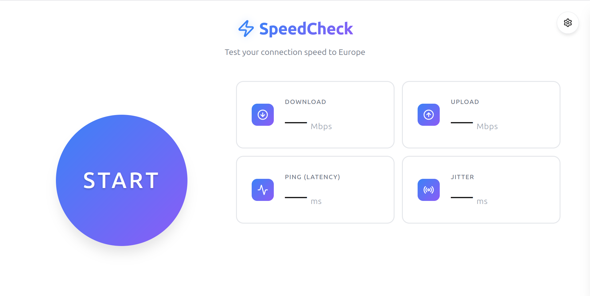
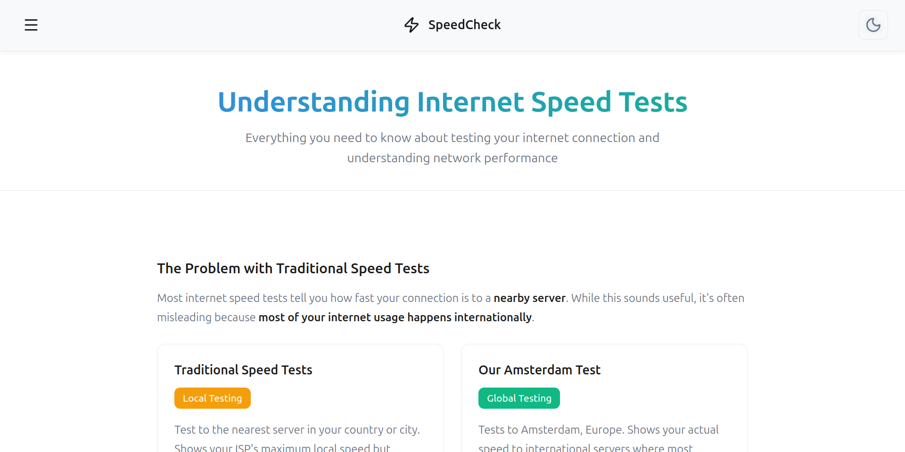

# SpeedCheck 

> Test your real-world international internet speed

[](https://speed-test.up.railway.app/)
[](#license)
[](#)
[](docs/CHANGELOG.md)
[](docs/TECHNICAL_NOTES.md)
[](docs/FUNCTIONALITY.md)

**[🚀 Try it live](https://speed-test.up.railway.app/)** • **[📚 Learn More](https://speed-test.up.railway.app/learn)**

### 📸 Application Screenshots

<div align="center">

**Main Speed Test Interface**



**Educational Content Page**



</div>

---

## 🎯 What Makes SpeedCheck Different?

Most internet speed tests use **nearby servers** to show you optimal speeds - but that's not how you actually use the internet. SpeedCheck measures your **real-world international connectivity** by testing your connection to a server in **Amsterdam, Netherlands**.

### SpeedCheck vs Other Speed Tests

| Feature | SpeedCheck | Traditional Speed Tests |
|---------|------------|------------------------|
| **Server Location** | Amsterdam, Netherlands (Fixed) | Automatically selects nearest server |
| **What It Measures** | Real international performance | Idealized local network speed |
| **Use Case** | Streaming European content, international browsing, video calls abroad | Local network capacity testing |
| **Distance Impact** | Reflects actual routing and latency | Minimizes distance to show best case |
| **Real-World Accuracy** | Shows speeds you'll actually experience for global content | Shows theoretical maximum speeds |

### When to Use SpeedCheck

✅ **Use SpeedCheck when:**
- You want to know your actual speed to European servers
- You're troubleshooting international streaming (Netflix, BBC iPlayer, sports streams)
- You need to understand your latency for international video conferencing
- You're curious about undersea cable and intercontinental routing performance

❌ **Use traditional speed tests when:**
- You want to test your ISP's maximum local bandwidth
- You're troubleshooting issues with your local network equipment
- You need to verify you're getting the speeds promised by your ISP contract

---

## 🌍 Why Europe?

Our server is hosted in **Amsterdam, Netherlands** - a major internet hub with excellent global connectivity. Testing to a fixed European location provides:

- **Consistent baseline** for comparing results over time
- **Real-world international routing** through undersea cables and continental networks
- **Meaningful metrics** for accessing global content hosted in Europe or routed through European CDNs
- **Distance-based performance** that reflects actual usage patterns for international content

**Physical Reality:** Internet signals don't travel instantly. Light moves at 300,000 km/s, but internet data travels slower through fiber optic cables. Distance creates unavoidable latency - SpeedCheck shows you this reality.

---

## 📊 Understanding Your Results

### Download Speed
How fast you can receive data from European servers. Important for streaming video, downloading files, and loading web pages hosted internationally.

### Upload Speed
How fast you can send data to European servers. Critical for video conferencing, uploading files to cloud storage, and online gaming.

### Ping (Latency)
The round-trip time for a signal to reach Amsterdam and return. **Lower is better.** Physics limits this based on distance - expect 150-300ms from Africa, 100-200ms from Middle East, 10-50ms from Europe.

### Jitter
How consistent your connection is. **Lower is better.** High jitter causes stuttering in video calls and unstable streaming. Good connections have jitter under 20ms.

---

## ✨ Features

### User Experience
-  **Real-time Updates** - Live gauge and metrics during test
- 🎯 **Progress Indicators** - Animated border progress on each measurement phase
- 📱 **Mobile Responsive** - Seamless experience on all devices
- 🌓 **Dark/Light Theme** - System preference detection with manual toggle
- 🎨 **Pure CSS Gauge** - 270° arc progress indicator (no chart libraries)
- 📊 **Comprehensive Metrics** - Download, Upload, Latency, Jitter
- ⚙️ **Configurable Tests** - Adjust parallel connections and test duration
- 🔒 **Secure & Private** - No data logging, no tracking, no analytics
- 📲 **PWA Support** - Add to Home Screen capability with proper icons

### Educational Content
- 📚 **Comprehensive Guide** - [/learn](https://speed-test.up.railway.app/learn) page explaining concepts
- 🌍 **Real-world Examples** - Kenya, Brazil cases showing local vs international speeds
- 📖 **Glossary** - All networking terms explained
- 💡 **Why Amsterdam** - Understanding server location impact
- 🔢 **Mbps vs MB/s** - Unit conversion guide

### Technical Features

**Frontend:**
- 🚀 **Zero Dependencies** - Pure vanilla JavaScript, no frameworks
- 📦 **Minimal Bundle** - Fast loading, efficient code
- ♿ **Accessible** - WCAG compliant, keyboard navigation
- 🔍 **SEO Optimized** - Open Graph, JSON-LD, sitemap.xml
- 🎭 **Custom 404** - Helpful error page with navigation
- 🎨 **Multi-format Icons** - SVG + PNG fallbacks for maximum compatibility
-  **Optimized Routing** - Express static middleware for clean URLs
- 🧠 **Memory Efficient** - Reusable chunk approach, 99.4% memory reduction
- 🎯 **Accurate Measurement** - XHR progress tracking for realistic speed results

**Backend:**
- 📊 **Production Observability** - Structured logging (Pino), Prometheus metrics
- 🛡️ **Circuit Breaker** - Overload protection with inflight request tracking
- 🔄 **Streaming Upload** - Memory-efficient binary data handling
- ⚡ **Performance Monitoring** - Request duration, success rates, throughput metrics
- 🔒 **Security Hardened** - Helmet.js, CORS, rate limiting, size limits

---

## 🔧 Technical Architecture

### Project Structure

```
internet_speed_test/
├── frontend/                 # Frontend web application
│   ├── index.html           # Main speed test interface
│   ├── learn.html           # Educational content page
│   ├── 404.html             # Custom error page
│   ├── main.js              # Speed test logic & UI management (2,124 lines)
│   ├── main.css             # Complete styling with theme support
│   ├── sw.js                # Service Worker for PWA & offline caching
│   ├── server.js            # Express static server with 404 handling
│   ├── package.json         # Frontend dependencies & version (v1.62.0)
│   ├── build-version.js     # Version synchronization automation script
│   ├── .npmrc               # npm configuration for cleaner logs
│   ├── site.webmanifest     # PWA manifest for Add to Home Screen
│   ├── favicon.svg          # Scalable site icon (Lucide zap)
│   ├── favicon-192x192.png  # PWA icon (Android/Chrome)
│   ├── favicon-512x512.png  # PWA icon (high-res devices)
│   ├── sitemap.xml          # SEO sitemap
│   └── robots.txt           # Search engine directives
├── backend/                 # API server
│   ├── server.js            # Express server with API endpoints
│   ├── package.json         # Backend dependencies & version (v1.62.0)
│   ├── .npmrc               # npm configuration
│   └── config/
│       └── index.js         # Centralized configuration management
├── docs/                    # Comprehensive documentation
│   ├── CHANGELOG.md         # Version history (296 lines)
│   ├── TECHNICAL_NOTES.md   # Design decisions & rationale (293 lines)
│   └── FUNCTIONALITY.md     # System architecture & internal workings (576 lines)
└── railway.json             # Railway deployment configuration
```

### Frontend Stack
- **Pure HTML/CSS/JavaScript** - Zero frameworks, fast loading, minimal bundle
- **CSS Conic Gradient Gauge** - 270° arc progress indicator with real-time updates
- **Progress Border Animation** - Real-time requestAnimationFrame-driven border progress
- **Multi-threaded Testing** - Parallel connections for accurate speed measurement
- **Responsive Design** - Mobile-first approach with breakpoints
- **Lucide Icons** - Clean, modern SVG iconography
- **Theme Support** - Dark/light mode with system preference detection
- **PWA Manifest** - Add to Home Screen with multiple icon formats (SVG + PNG)
- **SEO Optimized** - Open Graph, JSON-LD structured data, sitemap

### Backend Stack
- **Node.js + Express 5.1.0** - Lightweight REST API
- **Railway Hosting** - Deployed in Amsterdam, Netherlands (fixed location)
- **Pino Logging** - Structured JSON logging with pretty printing in development
- **Prometheus Metrics** - Request rates, durations, inflight tracking, throughput
- **Circuit Breaker** - Automatic overload protection (503 when inflight > 100 requests)
- **Security Middleware** - Helmet.js, CORS, compression, rate limiting
- **Streaming Upload** - Memory-efficient binary data handling without body parsing
- **Health Monitoring** - `/health` and `/metrics` endpoints for observability

### API Endpoints

#### Speed Testing
- **`GET /api/ping`** - Single ping round-trip time measurement
  - Returns: `{ latency: number }` in milliseconds
  
- **`POST /api/ping-batch`** - Multiple pings for jitter calculation
  - Body: `{ count: number }` (default: 10)
  - Returns: `{ latencies: number[], jitter: number }`
  
- **`GET /api/download`** - Download speed test
  - Query: `?size=<MB>` (default: 10MB, max: 50MB)
  - Returns: Binary data stream (uncompressed for accuracy)
  - CORS: Enabled for browser testing
  
- **`POST /api/upload`** - Upload speed test
  - Body: Binary data stream
  - Returns: `{ receivedBytes: number, duration: number }`
  - Note: Uses streaming for memory efficiency

#### Metadata & Health
- **`GET /api/info`** - Server information
  - Returns: `{ serverLocation, maxDownloadSize, maxUploadSize, supportedTests, version, rateLimit }`
  
- **`GET /health`** - Health check endpoint
  - Returns: `{ status: 'healthy', uptime: number, timestamp: number }`
  
- **`GET /metrics`** - Prometheus metrics endpoint
  - Returns: Prometheus-formatted metrics (text/plain)
  - Tracks: Request rates, durations, inflight count, download/upload bytes

---

## 🚀 Deployment Architecture

SpeedCheck uses a **distributed deployment strategy** with one backend and two geographically separated frontend deployments:

### Backend (API Server)
- **URL:** https://speed-test-backend.up.railway.app/
- **Platform:** Railway
- **Location:** Amsterdam, Netherlands (EU West)
- **Type:** Node.js Express server
- **Port:** 3000
- **Deployment:** Automatic on push to `main` branch
- **Purpose:** Speed test API endpoints for download/upload/ping measurements

### Frontend #1 (Primary - Railway)
- **URL:** https://speed-test.up.railway.app/
- **Platform:** Railway
- **Location:** Amsterdam, Netherlands (EU West)
- **Type:** Express.js static file server
- **Port:** 8080
- **Deployment:** Automatic on push to `main` branch
- **Purpose:** Primary user interface, co-located with backend for optimal latency

### Frontend #2 (Regional - Cloudflare Pages)
- **URL:** https://speed-test-ahc.pages.dev/
- **Platform:** Cloudflare Pages
- **Location:** Dar es Salaam, Tanzania (Africa)
- **Type:** Static site hosting (CDN edge deployment)
- **Deployment:** Manual via `wrangler pages deploy` or `./frontend/deploy-cloudflare.sh`
- **Purpose:** Regional frontend serving African users with lower latency for UI loading

### Architecture Rationale

**Why Two Frontend Deployments?**

1. **Improved User Experience:**
   - Users in Africa experience faster initial page load from Cloudflare's Dar es Salaam edge location
   - Static assets (HTML/CSS/JS) served from geographically closer servers
   - Reduced Time to First Byte (TTFB) for better perceived performance

2. **Separation of Concerns:**
   - **UI delivery** optimized via CDN (Cloudflare) - fast page loads
   - **Speed test measurements** still connect to Amsterdam backend - accurate international speed testing
   - This separation allows fast UI while maintaining consistent measurement baseline

3. **Geographic Distribution:**
   - Railway Frontend: Serves European users optimally
   - Cloudflare Frontend: Serves African users optimally
   - Both frontends connect to the same Amsterdam backend for consistent speed measurements

**The Testing Flow:**
```
┌─────────────────────────────────────────────────────────────┐
│  User in Africa                                             │
├─────────────────────────────────────────────────────────────┤
│  1. Loads UI from Cloudflare (Dar es Salaam) - Fast        │
│     https://speed-test-ahc.pages.dev/                       │
│                                                             │
│  2. Speed test connects to Amsterdam backend - Real         │
│     https://speed-test-backend.up.railway.app/              │
│                                                             │
│  Result: Fast page load + Accurate international speed test │
└─────────────────────────────────────────────────────────────┘

┌─────────────────────────────────────────────────────────────┐
│  User in Europe                                             │
├─────────────────────────────────────────────────────────────┤
│  1. Loads UI from Railway (Amsterdam) - Fast               │
│     https://speed-test.up.railway.app/                      │
│                                                             │
│  2. Speed test connects to Amsterdam backend - Local        │
│     https://speed-test-backend.up.railway.app/              │
│                                                             │
│  Result: Fast page load + Low latency measurements          │
└─────────────────────────────────────────────────────────────┘
```

**Both frontends are identical** - same HTML, CSS, and JavaScript files. The only difference is geographic deployment location for optimal static asset delivery.

### Deployment URLs Summary

| Service | Platform | Location | URL | Auto-Deploy |
|---------|----------|----------|-----|-------------|
| Backend API | Railway | Amsterdam, NL | https://speed-test-backend.up.railway.app/ | ✅ Yes |
| Frontend (Primary) | Railway | Amsterdam, NL | https://speed-test.up.railway.app/ | ✅ Yes |
| Frontend (Regional) | Cloudflare Pages | Dar es Salaam, TZ | https://speed-test-ahc.pages.dev/ | ❌ Manual |

All three services are deployed from the same GitHub repository: https://github.com/ny-collins/internet_speed_test

---

### Railway Configuration

Create two services in your Railway project:

**Frontend Service:**
```bash
# Build Command:
cd frontend && npm install

# Start Command:
cd frontend && npm start

# Root Directory: /
# Watch Paths: frontend/**
```

**Backend Service:**
```bash
# Build Command:
cd backend && npm install

# Start Command:
cd backend && npm start

# Root Directory: /
# Watch Paths: backend/**
```

### Environment Variables (Backend)

| Variable | Description | Default |
|----------|-------------|---------|
| `PORT` | Server port | 3000 |
| `NODE_ENV` | Environment mode | development |
| `LOG_LEVEL` | Logging level (info, debug, warn, error) | info |
| `SERVER_LOCATION` | Server region label | Amsterdam, Netherlands |
| `CORS_ORIGIN` | Allowed CORS origins | * |
| `MAX_DOWNLOAD_SIZE_MB` | Maximum download test size | 50 |
| `MAX_UPLOAD_SIZE_MB` | Maximum upload test size | 50 |
| `ENABLE_RATE_LIMIT` | Enable rate limiting | true |
| `RATE_LIMIT_WINDOW_MS` | Rate limit window (milliseconds) | 60000 |
| `RATE_LIMIT_MAX` | Max requests per window | 120 |
| `ENABLE_METRICS` | Enable Prometheus metrics | true |
| `MAX_INFLIGHT_REQUESTS` | Circuit breaker threshold | 100 |

---

## 💻 Local Development

### Prerequisites
- Node.js 18+ and npm
- Git

### Setup

```bash
# Clone the repository
git clone https://github.com/ny-collins/internet_speed_test.git
cd internet_speed_test

# Install backend dependencies
cd backend
npm install

# Install frontend dependencies
cd ../frontend
npm install
```

### Running Locally

**Backend (Terminal 1):**
```bash
cd backend
npm run dev  # Starts the API server on http://localhost:3000
```

**Frontend (Terminal 2):**
```bash
cd frontend
npm start  # Starts the frontend development server on http://localhost:8080
# Access at http://localhost:8080
```

**Important:** The frontend is designed to connect to the backend API. **You must have both servers running** to perform a speed test. The frontend makes API calls to the backend for download/upload tests and ping measurements.

### ⚠️ Important Note on Local Testing

**Local speed tests will show unrealistic results!** If you test against `localhost`, you'll see speeds of 1000+ Mbps because:

- ❌ **No network distance** - Data doesn't leave your computer
- ❌ **No routing overhead** - Bypasses all internet infrastructure  
- ❌ **No ISP involvement** - No real internet connection
- ❌ **Perfect conditions** - Not representative of actual performance

**For accurate measurements, always test against the [live deployment](https://speed-test.up.railway.app/).** The value of this tool is measuring real international connectivity.

### Development Workflow

1. **Make changes** to frontend or backend code
2. **Test locally** for UI/UX and functionality
3. **Test speed measurements** against live deployment
4. **Commit and push** to trigger automatic Railway deployment

---

## 📖 What This Project Teaches

This project demonstrates real-world internet concepts:

1. **Internet Geography** - Distance matters; signals can't travel faster than physics allows
2. **Network Routing** - Connection quality depends on multiple hops, undersea cables, and ISP routing
3. **CDN Reality** - Content hosted far away will always be slower than local content
4. **Real-world Performance** - Benchmarks with nearby servers don't reflect actual usage
5. **Latency vs Bandwidth** - High bandwidth doesn't help if latency is high (critical for gaming/calls)
6. **Network Congestion** - Time of day and routing affects international speeds
7. **Jitter & Stability** - Consistent connections matter more than peak speeds for real-time apps

---

## 🎓 Use Cases

### For Users
- ✅ Test if your connection can handle 4K streaming from European services
- ✅ Troubleshoot international video conference quality
- ✅ Understand why European websites feel slower than local ones
- ✅ Compare your actual international speeds with ISP promises

### For Developers
- 💻 Learn multi-threaded speed testing implementation
- 💻 Study responsive web design patterns
- 💻 Understand internet routing and latency concepts
- 💻 See pure CSS gauge implementation without dependencies

### For Network Engineers
- 🔧 Baseline international routing performance
- 🔧 Debug ISP peering and routing issues
- 🔧 Measure undersea cable capacity impact
- 🔧 Analyze time-of-day congestion patterns

---

## 🤝 Contributing

Contributions are welcome! Areas for improvement:

- 🎨 **UI/UX improvements** - Better visualizations, animations
- 📚 **Educational content** - More examples, diagrams, explanations
-  **Performance optimizations** - Faster loading, better caching
- ♿ **Accessibility** - Screen reader support, keyboard navigation
- 🌍 **Internationalization** - Multi-language support
- 📝 **Documentation** - Better guides, API docs, tutorials
- 🧪 **Testing** - Unit tests, integration tests

### Contribution Guidelines

1. **Fork** the repository
2. **Create** a feature branch (`git checkout -b feature/amazing-feature`)
3. **Test** your changes locally
4. **Verify** speed measurements against live deployment (not localhost)
5. **Commit** with clear messages (`git commit -m 'Add amazing feature'`)
6. **Push** to your branch (`git push origin feature/amazing-feature`)
7. **Open** a Pull Request

### Code Style
- Use consistent formatting (2 spaces, semicolons)
- Keep comments minimal (section markers only)
- Self-documenting code preferred
- Test on multiple browsers/devices

---

## 📋 Version History

### v1.63.0 (Current)
**🔧 Critical Bug Fixes & Measurement Accuracy**

**Critical Fixes:**
- ✅ **Module Import Error**: Fixed `ReferenceError: ui is not defined` preventing speed tests from starting
- ✅ **Speed Display Discrepancy**: Console and UI now show identical download/upload speeds
- ✅ **Sparkline Rendering**: Fixed SVG path errors during latency testing
- ✅ **Timing Accuracy**: Speed calculations now use exact test duration (no post-duration data)

**Learn Page Enhancements:**
- 📚 **Table of Contents**: Added sticky navigation with smooth scrolling
- 🎨 **Professional Design**: Enhanced typography, visual hierarchy, and responsive layout
- ♿ **Accessibility**: Improved navigation and screen reader support

**Impact:** Fully functional speed testing with accurate measurements and enhanced user experience

---

### v1.62.0
**🔒 Critical Security & Stability Fixes**

**Critical Bug Fixes:**
- 🛡️ **Division-by-Zero Guards** - Prevent Infinity in speed calculations
- 🔄 **Unhandled Promise Rejections** - Added .catch() handlers to all thread promises
- 🔐 **XSS Prevention** - Replaced innerHTML with DOM manipulation in history display
- ⏱️ **Client-Side Rate Limiting** - 10-second cooldown between tests (prevents spam-clicking)
- 🧠 **Service Worker Memory Optimization** - Use Page Visibility API to pause updates when tab inactive

**Impact:** Production-hardened security, better error handling, reduced memory pressure

---

### v1.60.0
**⚡ Fixed-Duration Testing & Major Simplification**

**Core Testing Overhaul:**
- ⏱️ **Fixed 10-Second Tests** - Download and upload tests now complete in exactly 10 seconds each
- 🎯 **Instant Results** - Total test time reduced from ~120s to ~25s (5x faster)
- 🚫 **No More Freezes** - Eliminated UI freezing during speed tests
- 📊 **Accurate Measurements** - Speed calculated from actual bytes transferred in fixed time window
- 🧹 **Code Simplification** - Removed ~88 lines of complex thread completion tracking

**Critical Bug Fixes:**
- 🔄 **PWA Update Mechanism** - Fixed Update Now button (moved state to global STATE.pwa object)
- 📴 **Offline Caching** - Fixed silent cache failure (updated ASSETS_TO_CACHE with versioned assets)
- 📈 **Upload Speed Drop** - Enhanced XHR lifecycle tracking (prevents 7 Mbps → 1.3 Mbps drop)
- 📊 **Real-Time Display** - Speed gauge now updates every 100ms (fixed em dash bug)
- 🌍 **Server Location Banner** - Now correctly displays "EU WEST (Amsterdam, Netherlands)"
- ⚙️ **Settings Panel** - Default duration now shows 10 seconds (matches actual behavior)

**Quality Improvements:**
- 🎯 **Stability Detection** - Analyze 10-sample window (more reliable, less sensitive to outliers)
- 🎨 **Service Worker UX** - Beautiful gradient update banner with user control
- 🤖 **Version Automation** - build-version.js script eliminates manual sync errors
- 🏗️ **Deployment Architecture** - Proper build/deploy separation with railway.json

**Code Cleanup:**
- 🧹 Removed ~273 lines of deprecated and complex code
- 📝 Removed unused result-schema.json
- 🔧 Added .npmrc for cleaner deployment logs
- 📚 Reorganized documentation structure

**Documentation:**
- 📚 **TECHNICAL_NOTES.md** - Comprehensive design decisions, discrepancies, and rationale
- 🏗️ **FUNCTIONALITY.md** - Complete system architecture and internal workings
- 📝 **Updated CHANGELOG** - Full version history with detailed release notes

**Philosophy Change:**
Transitioned from "test-to-completion" (run until threads finish) to "fixed-duration" (measure speed in exact time window). This aligns with the principle: *"Speed is measured by taking a small chunk of time and seeing how many packets are transferred."*

---

### v1.05.0
**🚀 Major Upload & Backend Improvements**

**Backend Enhancements:**
- 📊 **Production Observability Stack** - Structured logging with Pino, Prometheus metrics, circuit breaker protection
- 🛡️ **Advanced Monitoring** - Request tracking, inflight limits, performance metrics
- 🔄 **Stream-Friendly Body Parsing** - Skip body parsing for upload endpoints to enable true streaming
- ⚡ **Optimized Upload Handling** - Efficient binary data streaming without memory buffering

**Frontend Critical Fixes:**
- 🎯 **Accurate Upload Speed Measurement** - Fixed upload speed calculation using XHR progress tracking
- 🧠 **Memory Optimization** - Reusable 64KB chunk approach eliminates slow crypto generation (40MB → 64KB allocation)
- 🔧 **Crypto API Compliance** - Respect browser's 65536-byte limit for crypto.getRandomValues()
- 🎨 **Enhanced Error Logging** - Comprehensive diagnostic messages for troubleshooting
- ✅ **Smart Feature Detection** - Improved streaming support detection with graceful fallbacks
- 🛠️ **AbortController Cleanup** - Idempotent cleanup prevents memory leaks
- 🎭 **Race Condition Guards** - Done flags prevent double-resolve/reject in async operations

**Performance Impact:**
- Upload generation time: **20+ seconds → <1 second**
- Memory usage: **99.4% reduction** (40MB+ → 64KB per thread)
- Measurement accuracy: **Realistic speeds** matching download performance

**Testing & Quality:**
- ✅ All 14 backend tests passing
- ✅ Production deployment verified
- ✅ Upload/download speeds now show realistic, comparable values

### v1.04.1
- 🎨 Added PWA support with multi-format icons (SVG + PNG fallbacks)
-  Optimized Express routing (removed redundant explicit routes)
- 🔍 Fixed sitemap.xml (removed 404.html for better SEO)
- 🧹 Applied DRY principle to theme icon updates
- 📸 Added learn page screenshot to documentation
- 🗂️ Removed redundant files for better organization

### v1.03
- ✨ Added comprehensive `/learn` educational page
- 🎯 Real-time progress border animations during measurements
- 🎨 Refined favicon matching header icon
- 🧹 Complete code cleanup (removed verbose comments)
- 📄 Custom 404 error page
- 📚 Enhanced README with technical documentation
- 🔍 Improved SEO with updated sitemap

### v1.02
- 🌓 Dark/light theme toggle
- 📊 Enhanced gauge visualization
- ⚙️ Configurable test settings
- 📱 Mobile responsive improvements

### v1.01
-  Initial release
- 🎯 Core speed testing functionality
- 🎨 Pure CSS gauge
- 📊 Basic metrics display

---

## � Documentation

Comprehensive technical documentation is available in the `docs/` folder:

- **[CHANGELOG.md](docs/CHANGELOG.md)** - Complete version history and release notes (v1.00 to v1.62.0)
- **[TECHNICAL_NOTES.md](docs/TECHNICAL_NOTES.md)** - Design decisions, methodology, known discrepancies, and rationale
- **[FUNCTIONALITY.md](docs/FUNCTIONALITY.md)** - System architecture, test flow, and how everything works internally

These documents provide deep insights into:
- Why we use fixed-duration testing (10 seconds)
- How multi-threaded measurements work
- Speed calculation formulas and algorithms
- Known edge cases and false positives
- API specifications and configuration
- PWA lifecycle and offline behavior

---

## 🚀 Future Plans

The following enhancements are planned for future releases:

### **Phase 1: Comprehensive Testing Strategy** (High Priority)

**Backend Testing:**
- Edge case tests for rate limiter (429 responses)
- Circuit breaker tests (503 service unavailable)
- Invalid input validation tests
- Boundary value testing for all API parameters
- Target: 80%+ code coverage

**Frontend Testing:**
- Unit tests for pure functions (calculateJitter, formatSpeed, etc.)
- Component tests for UI interactions
- Mock DOM testing
- Configuration management tests

**End-to-End Testing:**
- Complete speed test flow automation
- Settings panel interaction tests
- Theme toggle and PWA functionality tests
- Cross-browser compatibility tests
- Offline mode testing

**Tools:**
- Jest for unit/integration tests
- Playwright or Cypress for E2E tests
- Testing infrastructure setup

### **Phase 2: CI/CD Automation** (High Priority)

**GitHub Actions Workflow:**
- Automated testing on every push to main
- Lint and format checking
- Backend test suite execution
- Frontend test suite execution
- E2E smoke tests
- Automatic deployment to Railway (only if all tests pass)
- Build status badges for README

**Benefits:**
- Catch regressions early
- Confidence to refactor safely
- Professional development workflow
- Deployment safety guarantees

### **Phase 3: Long-term Architectural Refinements** (Lower Priority)

**Code Quality:**
- Refactor monolithic test functions (measureDownload, measureUpload)
- Extract helper functions (monitorProgress, checkStability, calculateFinalSpeed)
- Improve single responsibility principle compliance
- Better testability through modular design

**State Management:**
- Migrate from global STATE object to store pattern
- Implement getters and setters for state changes
- Better encapsulation and change tracking
- More predictable state mutations

**Note:** These refinements are deferred until comprehensive testing is in place to ensure safe transformation.

### **Timeline**

- ✅ **v1.63.0** (Current) - Critical bug fixes, measurement accuracy, learn page enhancements
- 🔄 **v1.70.0** (Next) - Testing infrastructure + CI/CD pipeline
- 📋 **v2.00.0** (Future) - Architectural refinements + enhanced features

---

## 📄 License

This project is licensed under the MIT License - see the [LICENSE](LICENSE) file for details.

---

## 🌐 Related Resources

- [Understanding Internet Routing](https://www.cloudflare.com/learning/network-layer/what-is-routing/)
- [How Undersea Cables Work](https://www.submarinecablemap.com/)
- [Content Delivery Networks Explained](https://www.cloudflare.com/learning/cdn/what-is-a-cdn/)
- [Latency vs Bandwidth](https://www.cloudflare.com/learning/performance/glossary/what-is-latency/)

---

**Made with  to show real internet performance, not just marketing numbers.**