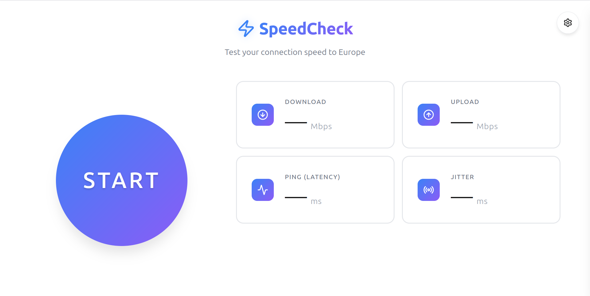

# SEO Enhancement Guide for SpeedCheck

This guide explains the SEO enhancements implemented and provides actionable steps for monitoring and improving your website's search engine visibility.

---

## ✅ Implemented Enhancements

### 1. JSON-LD Structured Data (Schema.org)

**What it is:**
Structured data helps search engines understand your website content and can enable rich results (enhanced search listings) in Google.

**What we added:**
- WebApplication schema with detailed app information
- Feature list highlighting key functionality
- Organization information
- Pricing information (free app)
- Aggregate rating placeholder

**Benefits:**
- 📊 **Rich snippets** in search results (star ratings, app info)
- 🔍 **Better understanding** by search engines
- 📈 **Higher click-through rates** from search results
- 🎯 **Featured in app-specific searches**

**How to test:**
1. Go to [Google Rich Results Test](https://search.google.com/test/rich-results)
2. Enter URL: `https://speed-test.up.railway.app/`
3. Check if structured data is detected
4. Fix any errors or warnings

**How to validate:**
```bash
# Or use the URL tester
https://validator.schema.org/
# Paste your page URL or the JSON-LD code directly
```

---

### 2. Mobile Theme Color

**What it is:**
The `theme-color` meta tag customizes the browser's UI color on mobile devices (address bar, status bar).

**What we added:**
- Dark theme color: `#1a1a2e` (matches your dark mode)
- Light theme color: `#ffffff` (matches your light mode)
- Automatic switching based on user's system preference

**Benefits:**
- 🎨 **Brand consistency** across browser UI
- 📱 **Professional mobile experience**
- 🌓 **Respects user's theme preference**

**How to test:**
1. Open your site on an Android phone (Chrome/Edge)
2. Notice the address bar matches your theme
3. Switch system theme and reload to see color change

---

## 🧪 Testing Your SEO Enhancements

### A. Lighthouse Audit (Chrome DevTools)

**Step-by-step:**

1. Open your live site: `https://speed-test.up.railway.app/`
2. Press `F12` to open Chrome DevTools
3. Click the **Lighthouse** tab (or find it in "More tools")
4. Select categories to audit:
   - ✅ Performance
   - ✅ Accessibility
   - ✅ Best Practices
   - ✅ SEO
5. Click **"Analyze page load"**
6. Wait for results (30-60 seconds)

**What to look for:**

**Performance (Target: 90+)**
- **LCP (Largest Contentful Paint)**: < 2.5s (how fast main content loads)
- **FID (First Input Delay)**: < 100ms (how fast site responds to clicks)
- **CLS (Cumulative Layout Shift)**: < 0.1 (visual stability)

**SEO (Target: 100)**
- All meta tags present ✅
- Canonical URL correct ✅
- Mobile-friendly ✅
- Structured data valid ✅

**Current Expected Scores:**
- Performance: ~85-95 (depends on server response time)
- Accessibility: ~95-100 (good semantic HTML)
- Best Practices: ~95-100 (HTTPS, secure headers)
- SEO: ~100 (comprehensive meta tags)

**Common improvements:**
- Add `width` and `height` attributes to images (prevents layout shift)
- Enable text compression on server
- Add caching headers
- Optimize images (convert to WebP)

---

### B. Social Media Preview Testing

**Facebook/Open Graph:**

1. Go to [Facebook Sharing Debugger](https://developers.facebook.com/tools/debug/)
2. Enter URL: `https://speed-test.up.railway.app/`
3. Click **"Debug"**
4. Check preview card appearance
5. Click **"Scrape Again"** if you update meta tags

**Twitter Card:**

1. Go to [Twitter Card Validator](https://cards-dev.twitter.com/validator)
2. Enter URL: `https://speed-test.up.railway.app/`
3. Click **"Preview card"**
4. Verify title, description, and image display correctly

**LinkedIn:**

1. Go to [LinkedIn Post Inspector](https://www.linkedin.com/post-inspector/)
2. Enter URL: `https://speed-test.up.railway.app/`
3. Check preview and click **"Inspect"**

**What to fix if previews look wrong:**
- Update Open Graph tags in `index.html`
- Add an og:image (1200x630px recommended)
- Clear cache using the validators above

---

### C. Structured Data Validation

**Google Rich Results Test:**

1. Go to [Rich Results Test](https://search.google.com/test/rich-results)
2. Enter URL: `https://speed-test.up.railway.app/`
3. Wait for analysis
4. Check for:
   - ✅ Valid structured data detected
   - ✅ No errors or warnings
   - ✅ Preview of how it might appear in search

**Schema.org Validator:**

1. Go to [Schema Markup Validator](https://validator.schema.org/)
2. Select "Fetch URL" tab
3. Enter: `https://speed-test.up.railway.app/`
4. Click **"Run Test"**
5. Verify WebApplication schema is valid

---

## 📊 Monitoring SEO Performance

### Google Search Console (Primary Tool)

**Initial Setup:**

1. Go to [Google Search Console](https://search.google.com/search-console)
2. Click **"Add Property"**
3. Choose **"URL prefix"** method
4. Enter: `https://speed-test.up.railway.app/`
5. Verify ownership using one of these methods:
   - **HTML meta tag** (already in your index.html! ✅)
   - Upload HTML file
   - Google Analytics
   - Google Tag Manager

**Your verification tag is already present:**
```html
<meta name="google-site-verification" content="zdVZ1S33sjYK8fbzC_MPEwMIDRISvUkH7Z6W_WyGC9o" />
```

6. Click **"Verify"**

**After Verification - Key Actions:**

1. **Submit Sitemap:**
   - Go to "Sitemaps" section
   - Enter: `sitemap.xml`
   - Click **"Submit"**
   - Check back in 24-48 hours for indexing status

2. **Request Indexing:**
   - Go to "URL Inspection"
   - Enter: `https://speed-test.up.railway.app/`
   - Click **"Request Indexing"**
   - Google will crawl within hours/days

3. **Monitor These Metrics:**
   - **Total clicks** - How many people visit from Google
   - **Total impressions** - How often you appear in search
   - **Average CTR** - Clicks ÷ Impressions (aim for 3-5%)
   - **Average position** - Your ranking in search results (aim for top 10)

4. **Check Core Web Vitals:**
   - Go to "Experience" → "Core Web Vitals"
   - Monitor mobile and desktop performance
   - Fix any issues flagged

5. **Review Coverage Report:**
   - Go to "Indexing" → "Pages"
   - Check which pages are indexed
   - Fix any errors or warnings

---

### Bing Webmaster Tools (Secondary)

1. Go to [Bing Webmaster Tools](https://www.bing.com/webmasters)
2. Sign in with Microsoft account
3. Click **"Add a site"**
4. Enter: `https://speed-test.up.railway.app/`
5. Choose verification method:
   - Add XML file to site
   - Add meta tag to HTML
   - CNAME record (if you control DNS)
6. Submit sitemap: `https://speed-test.up.railway.app/sitemap.xml`

**Note:** Bing is smaller but important for:
- DuckDuckGo search results (uses Bing)
- Yahoo search results (uses Bing)
- Windows Cortana results

---

## 🎯 Next Level: Advanced SEO

### 1. Add OG:Image for Social Sharing

Create a preview image (1200x630px) and add:

```html
<meta property="og:image" content="https://speed-test.up.railway.app/social-preview.png">
<meta property="og:image:width" content="1200">
<meta property="og:image:height" content="630">
<meta property="og:image:alt" content="SpeedCheck - Internet Speed Test Interface">
```

**Design tips:**
- Include your logo/brand
- Show app screenshot
- Add tagline: "Test your connection speed to Europe"
- Use high contrast colors
- Test with [Meta Tags](https://metatags.io/)

### 2. Add FAQ Schema for Common Questions

```json
{
  "@context": "https://schema.org",
  "@type": "FAQPage",
  "mainEntity": [{
    "@type": "Question",
    "name": "Why does SpeedCheck use a European server?",
    "acceptedAnswer": {
      "@type": "Answer",
      "text": "SpeedCheck measures real-world international connectivity by testing to Amsterdam, Netherlands. This shows actual speeds for streaming European content, international browsing, and global services."
    }
  }]
}
```

### 3. Enable Analytics

**Google Analytics 4:**
1. Create property at [Google Analytics](https://analytics.google.com/)
2. Get tracking ID (G-XXXXXXXXXX)
3. Add to your HTML:

```html
<!-- Google Analytics -->
<script async src="https://www.googletagmanager.com/gtag/js?id=G-XXXXXXXXXX"></script>
<script>
  window.dataLayer = window.dataLayer || [];
  function gtag(){dataLayer.push(arguments);}
  gtag('js', new Date());
  gtag('config', 'G-XXXXXXXXXX');
</script>
```

**Track Events:**
- Speed test starts
- Speed test completions
- Settings changes
- Theme toggles

### 4. Page Speed Optimizations

**Current opportunities:**

1. **Add image dimensions:**
```html

```

2. **Preconnect to external resources:**
```html
<link rel="preconnect" href="https://unpkg.com">
<link rel="dns-prefetch" href="https://unpkg.com">
```

3. **Add service worker for offline support:**
- Cache static assets
- Show "offline" message gracefully
- Improve repeat visit performance

4. **Optimize font loading:**
```css
/* If you add custom fonts */
@font-face {
  font-family: 'CustomFont';
  src: url('font.woff2') format('woff2');
  font-display: swap; /* Prevent invisible text */
}
```

### 5. Content SEO Strategy

**Blog posts you could create (markdown files):**
- "Why Your Internet Speed Varies by Location"
- "Understanding Ping, Jitter, and Latency"
- "How Undersea Cables Affect Your Internet Speed"
- "European vs Local Speed Tests: What's the Difference?"

**Benefits:**
- More indexed pages = more search traffic
- Educational content ranks well
- Demonstrates expertise
- Natural place for keywords

---

## 🔍 Keyword Strategy

**Primary keywords to target:**
- internet speed test europe
- speed test amsterdam
- international connection test
- bandwidth test european server
- latency test europe

**Content optimization:**
- Use keywords naturally in headings
- Update meta description to include target keywords
- Add keywords to footer content
- Create anchor text with keywords for internal links

---

## 📈 Expected Timeline

**Week 1-2:**
- Google crawls and indexes homepage
- Search Console shows initial impressions
- Structured data detected

**Month 1:**
- Ranking for branded searches ("SpeedCheck")
- Initial traffic from direct searches
- Core Web Vitals data appears

**Month 2-3:**
- Ranking for long-tail keywords
- Organic traffic grows
- Click-through rate stabilizes

**Month 3+:**
- Established presence in search
- Consistent organic traffic
- Opportunity to rank for competitive terms

---

## ✅ Your Current SEO Checklist

- [x] Sitemap.xml created and ready to submit
- [x] robots.txt allowing all crawlers
- [x] Canonical URL specified
- [x] Meta description and keywords
- [x] Open Graph tags for social sharing
- [x] Twitter Card tags
- [x] Google site verification tag
- [x] Structured data (JSON-LD) implemented
- [x] Mobile theme colors added
- [x] Screenshot added to README
- [ ] Submit sitemap to Google Search Console
- [ ] Submit sitemap to Bing Webmaster Tools
- [ ] Run Lighthouse audit and review scores
- [ ] Test social media previews
- [ ] Validate structured data
- [ ] Monitor indexing status
- [ ] Track Core Web Vitals
- [ ] (Optional) Add OG:image for social sharing
- [ ] (Optional) Enable Google Analytics
- [ ] (Optional) Create blog content

---

## 🆘 Common Issues & Solutions

**Issue: "Site not indexed after 2 weeks"**
- Solution: Request indexing via Search Console
- Check robots.txt isn't blocking (you're good ✅)
- Verify sitemap is accessible
- Ensure no "noindex" meta tags

**Issue: "Structured data not showing in rich results"**
- Solution: Google decides when/if to show rich results
- Focus on valid markup (we have it ✅)
- Provide complete information
- Be patient - can take months

**Issue: "Poor Lighthouse performance score"**
- Solution: Check Railway server response times
- Enable gzip compression
- Add caching headers
- Optimize any images
- Consider CDN for static assets

**Issue: "Social previews not updating"**
- Solution: Use validator's "Scrape Again" button
- Clear cache in social platforms
- Wait 24 hours for changes to propagate
- Verify meta tags are in HTML `<head>`

---

## 📚 Additional Resources

**Official Documentation:**
- [Google Search Central](https://developers.google.com/search) - SEO guidelines
- [Schema.org Documentation](https://schema.org/) - Structured data specs
- [Web.dev](https://web.dev/) - Performance and best practices

**Testing Tools:**
- [PageSpeed Insights](https://pagespeed.web.dev/) - Google's performance tool
- [GTmetrix](https://gtmetrix.com/) - Detailed performance analysis
- [Screaming Frog](https://www.screamingfrogseoseo.com/) - SEO spider tool (free up to 500 URLs)

**Learning:**
- [Google SEO Starter Guide](https://developers.google.com/search/docs/beginner/seo-starter-guide)
- [Moz Beginner's Guide to SEO](https://moz.com/beginners-guide-to-seo)
- [Ahrefs Blog](https://ahrefs.com/blog/) - SEO strategies and tips

---

**Need help?** Feel free to ask about any of these enhancements or monitoring steps!
